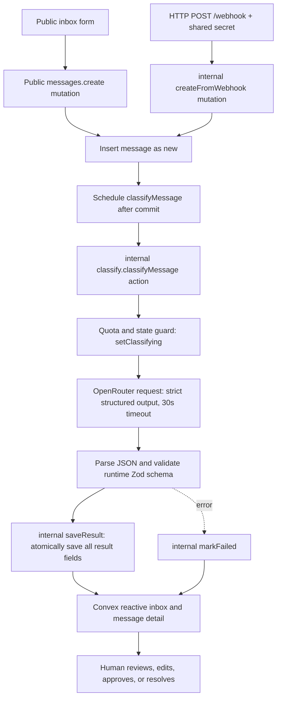

# TenantInbox

[](https://github.com/EliottV17/TenantInbox/actions/workflows/ci.yml)

TenantInbox is a fictional property-management demo that triages incoming tenant messages with an LLM, returning a structured category, urgency, summary, and suggested reply draft. A human reviews, edits, approves, or resolves each message in a reactive inbox; the generated draft is never sent automatically. Use fictional data only: this project has no authentication or access control.

> **Demo:** TODO — add a demo URL only if a safe, intended deployment is available.
>
> **Screenshot:** TODO — add a screenshot after the final UI is captured. No screenshot is included yet.

## What it does

- Accepts a message from the inbox form or a shared-secret HTTP webhook.
- Stores it as `new` and schedules classification after the create mutation commits.
- Calls OpenRouter for strict structured output, validates the response at runtime, and stores all classification fields together.
- Streams updates into the inbox through Convex reactive queries. Browse the latest 50 messages and filter by category or urgency.
- Lets a reviewer edit an unapproved draft, approve it, or resolve the message. Approval and resolution are human markers, not delivery actions.
- Provides manual retry for eligible failed or stuck classifications; there is no automatic retry loop or watchdog.

## Stack

| Technology | Role and reason |
| --- | --- |
| Next.js App Router, React, TypeScript | Server-rendered app shell and focused inbox routes/components, with typed UI code. |
| Convex | Reactive queries keep the inbox current; mutations provide atomic state changes; the scheduler hands classification to a background action. |
| OpenRouter | Model API for classification using structured JSON Schema output. The model ID is configured, not defaulted, in a Convex environment variable. |
| Zod 4 | One schema is used both to generate the OpenRouter JSON Schema and validate returned model content. |
| Bun | Project package manager, scripts, and CI runtime; the lockfile is committed and CI installs it frozen. |
| Tailwind CSS 4 | Utility styling and CSS theme tokens. |

## End-to-end flow



The create mutations atomically insert and schedule work. Actions perform the external fetch and call internal mutations to persist state. `saveResult` only writes when the message is still `classifying`, and writes category, urgency, summary, draft, timestamp, status, and cleared start time in one transaction. Failures do not partially save classification fields. Convex pushes committed changes to subscribed UI queries without polling.

The two entry points share the same input validation and scheduling behavior, but store different `channel` values. The webhook authenticates before parsing JSON; successful payloads then go through the internal create mutation rather than exposing it as a client API. Each message detail view uses a reactive query, so changes to classification and review timestamps appear as the corresponding mutations commit.

## Data model

Convex adds the system fields `_id` and `_creationTime` to every document. `_creationTime` is the creation epoch time; it is not a substitute for classification or human-action timestamps.

### `messages`

| Field | Type / values | Meaning |
| --- | --- | --- |
| `sender`, `subject`, `body` | strings | Tenant-provided message fields. Ingress trims whitespace and requires nonempty values; max lengths are 100, 200, and 5,000 characters respectively. |
| `channel` | `form` \| `webhook` | Ingestion source. |
| `status` | `new` \| `classifying` \| `classified` \| `failed` | Classification pipeline only. |
| `category` | optional `damage` \| `maintenance` \| `billing` \| `complaint` \| `general` | Model classification category. |
| `urgency` | optional `low` \| `medium` \| `high` | Model-assigned urgency. |
| `summary`, `draftReply` | optional strings | Model output, absent until a successful classification. |
| `failReason` | optional string | Readable classification failure reason. |
| `classifyingStartedAt` | optional number | Classification-start epoch milliseconds; cleared on successful/failed completion. |
| `classifiedAt` | optional number | Successful classification epoch milliseconds. |
| `approvedAt`, `resolvedAt` | optional numbers | Independent human approval and resolution epoch milliseconds. |

Index: `by_category[category]`. The built-in `by_creation_time` index supports newest-first inbox queries. Queries return at most 50 messages; there is no pagination.

`status` does not represent human review. Approving a draft sets `approvedAt`, and resolving sets `resolvedAt`; neither is a new pipeline status. Resolution is idempotent and does not overwrite an existing timestamp. An approved or resolved draft cannot be edited. A draft must be saved before approval; approval does not send email or otherwise deliver it.

| Pipeline status | Meaning in the interface |
| --- | --- |
| `new` | Created and waiting for classification. |
| `classifying` | An attempt is underway; after the stuck threshold, the UI warns that progress may have stopped. |
| `classified` | Structured result is available for human review. |
| `failed` | The attempt failed; a manual retry is available unless the message is approved or resolved. |

The inbox is newest-first, with category and urgency filters reflected in the URL. Messages without a category (such as newly created or failed messages) are naturally absent from a category-filtered result. The detail page shows the original message, classification summary and failure reason where present, draft controls, and independent approval/resolution indicators.

### `usage`

| Field | Type / values | Meaning |
| --- | --- | --- |
| `day` | string, UTC `YYYY-MM-DD` | Classification quota day. |
| `count` | number | Classification attempts counted for that day. |

Index: `by_day[day]`. The limit is 100 attempts per UTC day, checked before the OpenRouter request. It bounds LLM spend, not general access or abuse of the app.

## Classification, failures, and retries

`setClassifying` accepts only `new` or `failed`; it checks/increments the daily quota and records `classifyingStartedAt`. `saveResult` and `markFailed` only act on a message currently `classifying`. These guards protect current state, but there is no attempt-generation token or cancellation mechanism: do not assume that an older in-flight model request is fenced off from a later retry in every race.

A failure is stored for missing `OPENROUTER_API_KEY` or `OPENROUTER_MODEL`, exhausted quota, OpenRouter HTTP errors (including 429 and 5xx), invalid outer or model JSON, missing response content, truncation, Zod rejection, fetch/network errors, or a 30-second timeout. Successful classification fields are written atomically; a failed classification does not commit a partial result. Retries are manual and allowed only when `failed` or stuck for more than 120 seconds, and not approved or resolved. A stuck message displays a warning and offers manual retry; there is no automatic watchdog or exponential backoff.

Webhook POSTs are not deduplicated: repeating a valid request creates another message. There is no end-to-end ingestion idempotency token.

### Webhook secret comparison

The endpoint reads the `x-webhook-secret` header and Convex-side `WEBHOOK_SECRET`. It hashes both strings with the standard Convex V8 `crypto.subtle` SHA-256 API, then compares the fixed 32-byte digests with a constant-time XOR-accumulation loop that does not exit early on a differing byte. The implementation uses Web Crypto and does not import Node's `crypto` module. Missing configuration or a missing/mismatched header returns 401 before message creation.

### Runtime model validation

The runtime Zod schema accepts the category and urgency enums plus string-valued `summary` and `draftReply`. It does not enforce non-empty strings, lengths, or semantic content. The generated JSON Schema strips `$schema` and currently has no `minLength` or `maxLength` constraints; do not rely on stricter validation than the source implements.

## Security and limitations

> **Do not deploy this as a private or production inbox. Use fictional data only.**

- **There is no authentication or access control.** Anyone who can reach the app can view messages and invoke public functions to create, edit an unapproved draft, approve, resolve, or retry messages (subject to the existing state guards).
- The `WEBHOOK_SECRET` protects only the webhook endpoint. It does **not** secure the public UI or public Convex queries and mutations.
- The 100-per-UTC-day classification quota is an LLM budget limit, not general abuse protection. Public endpoints can still be abused for other purposes.
- An approved or resolved draft cannot be edited. Approval is only a stored human-review marker; no email integration or automatic reply delivery exists.
- The inbox is bounded to the newest 50 results, with no pagination.
- Duplicate webhook submissions create duplicate rows; there is no ingestion deduplication token.
- Classification retries are manual, with no automatic backoff or watchdog.

## Local setup

### Prerequisites

- Bun 1.4.2 (the version pinned for this project and CI).
- A Convex development deployment.
- An OpenRouter key and a model ID that supports strict structured output / JSON Schema.

### Install and run

Install dependencies from the committed lockfile:

```bash
bun install --frozen-lockfile
```

In **Terminal 1**, start the Convex development process and follow its prompts to configure or select a development deployment:

```bash
bunx convex dev
```

In **Terminal 2**, create the frontend environment file locally with the URL supplied by your Convex development setup, then start Next.js:

```dotenv
# .env.local (local frontend configuration only)
NEXT_PUBLIC_CONVEX_URL=https://<your-development-deployment>.convex.cloud
```

```bash
bun run dev
```

Open the local URL printed by Next.js (normally `http://localhost:3000`). Do not commit `.env.local` or place backend secrets in it. The placeholder URL in the client provider is only a safe fallback; replace it with the development deployment URL for a working app.

Configure backend-only values on the Convex development deployment. Load the API key and webhook secret into shell variables through a secure prompt or secret manager first; the commands below contain no real values and avoid putting literal secrets in shell history:

```bash
bunx convex env set OPENROUTER_API_KEY "$OPENROUTER_API_KEY"
bunx convex env set OPENROUTER_MODEL '<model-id-supporting-strict-structured-output>'
bunx convex env set WEBHOOK_SECRET "$WEBHOOK_SECRET"
```

The model has no code default; set `OPENROUTER_MODEL` explicitly. Never prefix backend secrets with `NEXT_PUBLIC_`, put them in frontend `.env.local`, or commit them. The backend reads the key, model, and webhook secret from Convex environment variables. OpenRouter receives a strict JSON-schema response-format request with `provider.require_parameters`; the actual response is still parsed and checked server-side before storage.

### Seed fictional messages

After the development deployment is running, populate it with 30 fictional, pre-classified fixtures:

```bash
bunx convex run seed:seedMessages
```

The seed checks exact `sender` + `subject` pairs, inserts missing fixtures, and skips existing pairs without modifying them. It is idempotent by that pair. It does not call the model, change usage counters, schedule classification, or delete data. The result reports `{ inserted, skipped }`.

### Optional webhook request example

The HTTP-action URL uses the Convex **site** host (`.convex.site`), not the client/cloud host (`.convex.cloud`). Local Convex development prints/provides its site URL as well. Set `CONVEX_SITE_URL` and `WEBHOOK_SECRET` in your shell from your own local setup; do not use a live URL or real tenant content in this example. This command is an example only—do not send requests as part of documentation checks.

```bash
curl -X POST "$CONVEX_SITE_URL/webhook" \
  -H 'Content-Type: application/json' \
  -H "x-webhook-secret: $WEBHOOK_SECRET" \
  -d '{"sender":"Fictional Tenant 4B","subject":"Example: dripping kitchen tap","body":"Water is dripping from the kitchen tap. Please let me know the next step."}'
```

A valid request returns HTTP `201` with JSON containing `success: true` and `messageId`. A missing/incorrect secret returns `401 Unauthorized`. Invalid JSON, a non-object body, missing/non-string fields, or content failing ingress validation returns `400` with a readable text response. Each valid POST creates its own message.

## Checks and CI

Run the project checks from the repository root:

```bash
bunx eslint . --max-warnings 0
bunx tsc --noEmit
(cd convex && bunx tsc --noEmit)
bun run test
```

Use `bun run test` for Vitest; `bun test` is Bun's separate test runner and is not this project's test command. The test suite uses Vitest and includes 86 tests across 12 files: 79 backend-logic and fixture tests, five React DOM tests for the form, and two React DOM fallback-page tests. Those UI tests use jsdom per-file and mock Convex/Next behavior where needed. Tests use mocks and lightweight fixtures; they are not full Convex database integration tests. `convex-test` is not installed; integration coverage remains a possible future improvement.

GitHub Actions runs on pushes to `main` and pull requests. The workflow grants `contents: read`, groups concurrency by workflow/ref and cancels superseded runs, checks out with `actions/checkout@v7` (credentials persistence disabled), and sets up Bun `1.4.2` with `oven-sh/setup-bun@v2`. It installs with `bun install --frozen-lockfile`, then runs ESLint, both TypeScript checks, Vitest, and `bun run build`. The build step receives only `NEXT_PUBLIC_CONVEX_URL=https://ci-placeholder.convex.cloud`; it does not need a real Convex deployment, secrets, code generation, deployment, or OpenRouter calls. Next.js uses `next/font/google`, so a build may need network access to fetch fonts; no offline-font guarantee is made.

The repository does not include a standard committed Playwright/browser end-to-end suite. Browser-matrix or manual harness verification is not represented by the Vitest results.

### Useful check order

For a quick local quality pass, run lint and both typechecks before the unit suite. All commands are intended to run at the repository root except the explicitly scoped Convex typecheck:

1. `bunx eslint . --max-warnings 0`
2. `bunx tsc --noEmit`
3. `(cd convex && bunx tsc --noEmit)`
4. `bun run test`

The CI build is an additional workflow step; it is not a substitute for these checks. Running `bunx convex dev` is a local setup action that connects the project to a development deployment, not part of unit-test execution or CI.

## Main routes and function boundaries

| Surface | Responsibility |
| --- | --- |
| `/inbox` | Reactive list, URL-backed filters, and collapsed-by-default message form. |
| `/inbox/[id]` | Reactive detail, draft editing/approval, manual retry, and resolution. |
| `messages.create` | Public form mutation; inserts a `form` message and schedules classification. |
| `POST /webhook` | HTTP action; validates the shared secret and payload, then calls an internal create mutation. |
| `classify.classifyMessage` | Internal scheduled action; guards state/quota, calls OpenRouter, and persists success/failure through internal mutations. |
| `seed:seedMessages` | CLI-invoked internal mutation; inserts fictional fixtures without classification work. |

The HTTP action runs in Convex's standard V8 runtime. Secret comparison uses Web Crypto rather than Node-only APIs, and the model call uses the runtime's `fetch` with an abort signal. No Node runtime directive or Node crypto dependency is required for these backend paths.

## Repository map

```text
src/                  Next.js App Router UI, components, hooks, and client helpers
convex/               Schema, public/internal functions, HTTP route, seed, generated types
  lib/                 Model schema and fictional seed fixtures
tests/                Vitest logic, fixture, and selected React DOM tests
docs/PLAN.md           Architecture plan and milestone scope
.github/workflows/     CI workflow
```

## Project workflow and future work

Work one milestone at a time on its own branch. Keep changes focused in atomic Conventional Commits in English; each commit must typecheck. Milestone changes go through the project's pull-request process, and must pass both typechecks, lint, and tests before handoff. Never commit secrets or deploy as part of this README/setup guide.

Potential future improvements—not current features—include authentication and authorization, pagination, Convex function integration tests, automatic exponential backoff, and an ingestion idempotency token. Any future access-control design should secure the public UI and Convex functions, not only the webhook.

## Troubleshooting notes

- **The inbox never connects:** confirm `NEXT_PUBLIC_CONVEX_URL` points at the development deployment's `.convex.cloud` URL and that the Convex development process is running.
- **New messages remain unclassified or fail:** inspect the message's visible `failReason`; check that both `OPENROUTER_API_KEY` and `OPENROUTER_MODEL` are configured in the correct Convex development environment, and that the selected model supports strict structured output.
- **Webhook returns 401:** confirm the backend `WEBHOOK_SECRET` matches the `x-webhook-secret` value, without adding the secret to frontend configuration.
- **Webhook returns 400:** send a JSON object with string `sender`, `subject`, and `body` fields that are nonempty after trimming and within the documented length limits.
- **A message appears stuck:** after more than two minutes, the UI offers a manual retry if the message is still unapproved and unresolved. Retry does not imply cancellation of any older external request.
