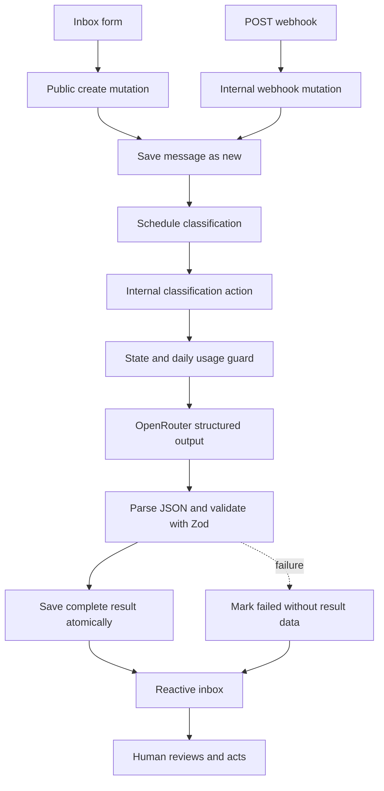

# TenantInbox

[](https://github.com/EliottV17/TenantInbox/actions/workflows/ci.yml)

TenantInbox is a fictional property-management demo that classifies tenant messages and suggests reply drafts. A human reviews every draft; nothing is sent automatically. **Use fictional data only:** the app has no authentication or access control.

<!-- TODO: Add a demo link when an intended, safe deployment exists. -->
<!-- TODO: Add a screenshot after capturing the final UI. -->

## What it does

- Accepts messages from an inbox form or a shared-secret HTTP webhook.
- Schedules classification after saving a new message; Convex keeps subscribed inbox views current.
- Stores a category, urgency, summary, and suggested reply after structured model output passes runtime validation.
- Supports editing, approval, resolution, and manual retries for eligible failures. Approval is a human marker, not delivery.

## Design decisions

- Pipeline status stays `new` / `classifying` / `classified` / `failed`; separate `approvedAt` and `resolvedAt` timestamps represent human actions without expanding the classifier state machine.
- State guards make repeated persistence calls no-ops once their expected status has changed, protecting completed pipeline transitions.
- A `usage` row indexed by UTC day enforces a daily classification-attempt cap before calling OpenRouter, bounding model spend.
- The webhook compares fixed-size SHA-256 digests with Web Crypto and XOR accumulation, avoiding early exit on differing secret bytes.
- One Zod schema generates the provider JSON Schema and validates returned data at runtime.
- Success fields are saved atomically; failures transition to `failed` without partially saved classification data.

## Stack and flow
Next.js App Router, React, TypeScript, Tailwind CSS 4, Convex, OpenRouter, Zod 4, and Bun. The model is configured through Convex environment variables, not defaulted in application code.



The create mutation schedules work after commit. An internal action makes the external request; internal mutations persist state. Convex queries update the UI reactively.

## Data model and limits

Convex adds `_id` and `_creationTime` to each document. `_creationTime` is creation time, not a substitute for classification or review timestamps.

| Table | Fields and behavior |
| --- | --- |
| `messages` | `sender`, `subject`, `body`; `channel`: `form` or `webhook`; pipeline `status`: `new`, `classifying`, `classified`, `failed`; optional `category`: `damage`, `maintenance`, `billing`, `complaint`, `general`; optional `urgency`: `low`, `medium`, `high`; optional `summary`, `draftReply`, `failReason`, `classifyingStartedAt`, `classifiedAt`, `approvedAt`, `resolvedAt`. |
| `usage` | UTC `day` (`YYYY-MM-DD`) and attempt `count`; 100 attempts/day, checked before the model request. This is an LLM budget cap, not general abuse protection. |

`messages` has index `by_category`; `usage` has `by_day`. The inbox is newest-first, with category and urgency filters. Classification timestamps track pipeline work; approval and resolution timestamps track human review.

## Security and limitations

Do not use this demo for private or production inboxes. The public UI and Convex functions have no authentication or access control; `WEBHOOK_SECRET` protects only the webhook. The quota limits model attempts, not other public access. Ingress trims nonempty values and limits `sender` to 100, `subject` to 200, and `body` to 5,000 characters. The inbox returns at most 50 results without pagination; webhook requests are not deduplicated. Approved or resolved drafts cannot be edited, and no email integration exists.

Missing configuration, exhausted quota, HTTP/network errors, invalid output, or a 30-second timeout leave a readable `failReason` instead of a partial result. Retry is manual for failed or more-than-120-second stuck classifications, unless approved or resolved; there is no watchdog or automatic backoff. State guards do not cancel older external requests, so an in-flight request can race with a retry.

The webhook checks `x-webhook-secret` against Convex-side `WEBHOOK_SECRET` using Web Crypto SHA-256 digests and a constant-time XOR loop. Missing or mismatched values return `401`; malformed or invalid payloads return `400`; accepted posts return `201` with `success: true` and `messageId`. The Convex **site URL** for HTTP actions is distinct from the client URL.

The model response schema has enum category/urgency and string summary/reply fields. Zod validates shape at runtime; it does not enforce nonempty strings or semantic quality. OpenRouter also receives strict JSON Schema output, but the response is still parsed and validated before storage.

## Local setup

Requirements: Bun 1.4.2 and an OpenRouter key plus model that supports strict structured output.

Install the committed lockfile and start Convex development:

```bash
bun install --frozen-lockfile
bunx convex dev
```

`bunx convex dev` configures a development deployment and automatically writes its client URL (`NEXT_PUBLIC_CONVEX_URL`) to `.env.local`; no manual environment file creation is needed. It may also write the HTTP actions site URL and add `.env.local` to `.gitignore`. Next.js reads the client URL. Local Convex URLs can use `http://127.0.0.1:3210`; `.convex.cloud` URLs refer to cloud deployments. Start the frontend in another terminal:

```bash
bun run dev
```

Open the URL printed by Next.js, normally `http://localhost:3000`. Load `OPENROUTER_API_KEY`, `OPENROUTER_MODEL`, and `WEBHOOK_SECRET` into shell variables using a secure prompt or secret manager, then set the backend-only values on the Convex development deployment:

```bash
bunx convex env set OPENROUTER_API_KEY "$OPENROUTER_API_KEY"
bunx convex env set OPENROUTER_MODEL "$OPENROUTER_MODEL"
bunx convex env set WEBHOOK_SECRET "$WEBHOOK_SECRET"
```

Do not place backend secrets in frontend environment files or commit them. The model ID is configurable and has no application-code default.

### Seed fictional messages

With the development deployment running, insert the fictional pre-classified fixtures:

```bash
bunx convex run seed:seedMessages
```

The internal mutation skips existing exact `sender` + `subject` pairs, inserts missing fixtures, and returns `{ inserted, skipped }`. It does not delete or modify existing messages, call the model, change usage, or schedule classification.

### Optional webhook example

Set `CONVEX_SITE_URL` and `WEBHOOK_SECRET` from your own development setup; the site URL is not the frontend's `NEXT_PUBLIC_CONVEX_URL`. The HTTP action URL is `<site-url>/webhook` (local site URLs may differ from cloud `.convex.site` URLs):

```bash
curl -X POST "$CONVEX_SITE_URL/webhook" \
  -H 'Content-Type: application/json' \
  -H "x-webhook-secret: $WEBHOOK_SECRET" \
  -d '{"sender":"Fictional Tenant 4B","subject":"Example: dripping tap","body":"Water is dripping from the kitchen tap. Please advise."}'
```

## Checks and CI

Run from the repository root. The test script runs Vitest, including **Vitest unit and React DOM tests**; it is not a full Convex database integration suite.

```bash
bunx eslint . --max-warnings 0
bunx tsc --noEmit
(cd convex && bunx tsc --noEmit)
bun run test
bun run build
```

GitHub Actions runs on pushes to `main` and pull requests. It installs with `bun install --frozen-lockfile`, runs lint, both typechecks, tests, and a build with a placeholder `NEXT_PUBLIC_CONVEX_URL`; CI does not deploy or call OpenRouter. `bun run test` invokes Vitest; `bun test` is Bun's separate test runner.

## Main routes and functions

| Surface | Responsibility |
| --- | --- |
| `/inbox` | Reactive list, URL-backed filters, and message form. |
| `/inbox/[id]` | Reactive detail, draft editing/approval, retry, and resolution. |
| `messages.create` | Public form mutation; inserts and schedules classification. |
| `POST /webhook` | Authenticates and validates input, then calls an internal create mutation. |
| `classify.classifyMessage` | Internal scheduled action; calls OpenRouter and persists success/failure. |
| `seed:seedMessages` | CLI-invoked internal mutation for fictional fixtures. |

## Repository map

```text
src/                  Next.js App Router UI and client helpers
convex/               Schema, functions, HTTP route, seed, generated types
  lib/                 Model schema and fictional seed data
tests/                Vitest tests, including selected React DOM coverage
docs/PLAN.md           Architecture plan and milestone scope
.github/workflows/     CI workflow
```

## Troubleshooting

- **Inbox will not connect:** confirm `bunx convex dev` is running and that `.env.local` has the client URL it configured (`NEXT_PUBLIC_CONVEX_URL`). For local Convex, use the printed local client URL; `.convex.cloud` is for cloud deployments.
- **Classification fails:** inspect `failReason`; verify `OPENROUTER_API_KEY` and `OPENROUTER_MODEL` are set on the correct Convex development deployment and support strict structured output.
- **Webhook returns `401` or `400`:** check the shared secret or the required nonempty string fields and documented length limits.

Developed against z-ai/glm-5.3-flash
